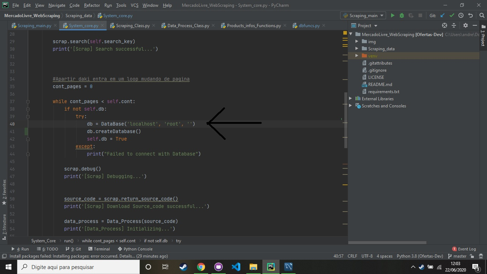
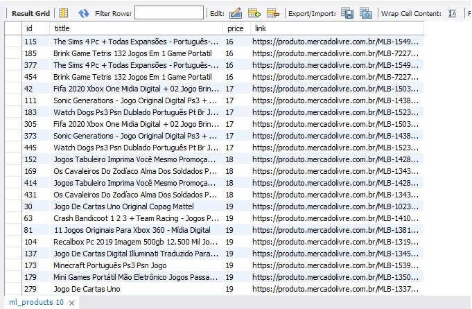

# MercadoLivre_WebScraping
 
 The system realize a Web scraping in the web site https://www.mercadolivre.com.br/ using python 3.8, with Selenium and save the data in a MySQL database.
 
 Requirements:
 - python 3.8 
 - MySQL database 
 - Chrome version: 83.0.4103.106 64 bits
 
 Use the command: pip install -r requirements.txt to install the packages needed
 
 
 In the file system_core.py line 40 you need alter the parameters of the Database("host","user","password") put the information of your database
 
 
To realize the web scraping run Scraping_main.py
and the content will be saved in the MySQL database:  

 
